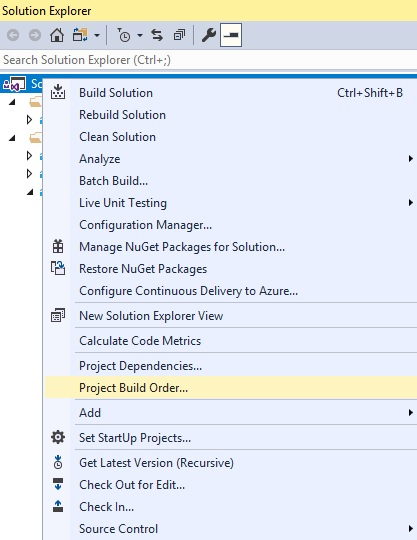
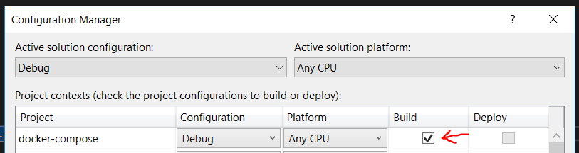
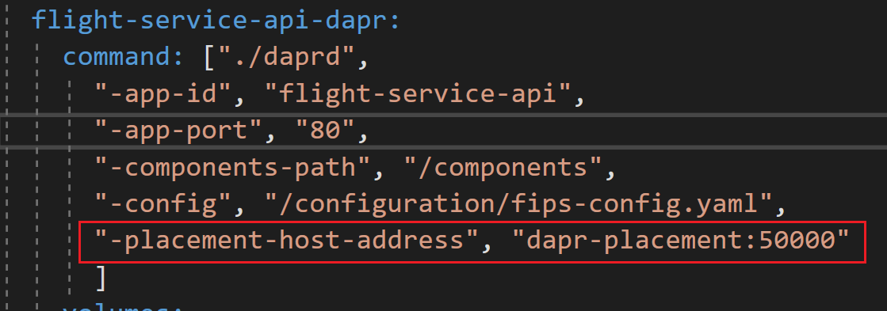

# 故障排除指南

## `Visual Studio`

### Error CS0006 Metadata file 'xxx\\xxx.dll' could not be found

1. 该项目所依赖的项目 `build` 失败。

2. 如果该项目是采用跨解决方案的项目引用方式，则需要在那个大解决方案下 `build` 后才能读取到它所依赖的 `dll`

### `NuGet` Error NU1105 If you are using `Visual Studio`, this may be because the project is unloaded or not part of the current solution so run a restore from the command-line. Otherwise, the project file may be invalid or missing targets required for restore.

执行：

```bash
dotnet restore MySolution.sln
```

### CS0104 but don't have relative ambiguous definition actually

产生了 `ambiguous definition of a symbol or identifier in the code`，但是代码编译器里面却没提示。

很可能是因为当前的 `code` 的版本比这个项目引用的 `dll` 更加新，换言之就是要 `build` 一下产生错误的那个 `dll`。

### Predefined type 'System.Object' is not defined or imported

Close the `Visual Studio`. Delete the `.vs` folder and restart `Visual Studio`. Everything should work fine.

Usually this happens when you change branches or merge branches.

### error msb3030 could not copy the file docker-compose

Set Project Build Order in `Visual Studio`

将 `docker-compose` 的依赖设定一下，让它靠后 `build`。



## `IIS`

### 401未授权:由于凭据无效,访问被拒绝解决

[IIS 401未授权解决方案](http://www.winwin7.com/JC/12013.html)

一般是匿名身份认证里面设定的用户可能不存在或没有加到正确组中，或组没有访问那个文件夹的权限之类。

## `EFCore`

### 发现增加条目时某个字段未被算上

1. `property` 是 `{get;}` 只读字段，它不算上。可以加上 `private set;`

### `System.InvalidOperationException`: The property 'Flight.Id' has a temporary value while attempting to change the entity's state to 'Modified'. Either set a permanent value explicitly, or ensure that the database is configured to generate values for this property.

可能 `Id` 是 `0`，然后调用的是 `Attach`、`Update` 方法，导致无法匹配上。

### The instance of entity type cannot be tracked because another instance with the same key value

[The instance of entity type cannot be tracked because another instance with the same key value for { 'ID'} is already being tracked. · Issue #28822 · dotnet/efcore](https://github.com/dotnet/efcore/issues/28822)

`DbContext` 在整个生命周期 `Scope` 内进行追踪。
在使用 `ABP` 仓储时，也是整个事务为一个范围，所以在两个方法里面查出同一个实体进行更新后再去数据库查相同的实体再更新就会出现此异常。

另外还有一种可能是 `Mapster` 的 `Map` 问题，如果 `Map` 中包含 `ID` 映射的，会将 `ChangeTrack` 中变为 `Not found`，特别是映射嵌套类的时候。所以需要 `IgnoreID` 列。具体原因待查。


### 枚举类型从数据库查出来只有0和1

发现同事在 `mysql` 数据库中的类型是 `tinyint 1`，虽然在数据库这边值正确，但在EFCore这边值只在0和1之间徘徊，改成 `int` 类型后正常。


## `C#`

### 开发

#### `System.InvalidOperationException`: 'Sequence contains no elements'

以下方法如果 `Where` 后没有符合的条件，都会引起这个异常：

- `First()`
- `Single()`
- `Last()`
- `LastAsync()`
- `Max()`
- `Min()`
- `Average()`
- `Aggregate()`

可以使用 `.DefaultIfEmpty()` 去规避。如果有类似 `SingleOrDefault()` 的也行。注意引用类型的 `DefaultIfEmpty` 是 `null`，所以用 `Min` 之类的要处理 `null` 的情况。

## `ASP.NET Core`

可以先在 `appsettings.json` 中开启日志

```json
"Logging": {
  "LogLevel": {
    "Default": "Information",
    "Microsoft.AspNetCore": "Information",
    "Microsoft": "Debug",
    "Microsoft.Hosting.Lifetime": "Information"
  }
}
```

### `gRPC`

#### Code: Unimplemented, Message: Service is unimplemented

`Dapr` 会调用

```protobuf
dapr.proto.runtime.v1.AppCallback/ListTopicSubscriptions
```

发现是因为如果采用了 `gRPC`，则不能用 `Topic` 特性标签那套（那套 `HTTP` 专用）了，得自己重新实现 `gRPC` 版的回调实现。

`Postman` 等会调用

```protobuf
grpc.reflection.v1alpha.ServerReflection/ServerReflectionInfo
```

方法获取 `gRPC` 的方法信息。

这种如果使用的是 `protobuf-net` 的，需要用

```csharp
builder.Services.AddCodeFirstGrpcReflection();
app.MapCodeFirstGrpcReflectionService();
```

这俩帮你写好的回调方法注册进去，就支持了。

还有就是自己的方法，可以先用 `Postman` 测一下支持的 `gRPC` 方法。

如果没发现自己定义的，就需要检查定义

（`protobuf-net`）

比如：

1. 请求响应类是否打上了 `ProtoContract` 标签

2. `service` 接口是否打上了 `ServiceContract` 标签

3. 请求响应类里面是否有类型不支持：

截至发现目前不支持的类型：

1. `DateOnly`、`TimeOnly`
2. `Computed property`

所以 `DTO` 类尽量用最简单的类型来表示。

#### Connection closed before server preface received

检查 `Dapr` 的 `app-protocol` 配置

检查是否 `server` 是开启 `TLS`，`Dapr` 似乎默认不是走 `TLS`？

检查 `server` 是否默认使用 `HTTP2` 协议

#### `InvalidOperationException`: Unable to get subchannel from `HttpRequestMessage`

```text
Grpc.Core.RpcException: Status(StatusCode="Internal", Detail="Error starting gRPC call. HttpRequestException: Unable to get subchannel from HttpRequestMessage. (127.0.0.1:41315) InvalidOperationException: Unable to get subchannel from HttpRequestMessage.", DebugException="System.Net.Http.HttpRequestException: Unable to get subchannel from HttpRequestMessage. (127.0.0.1:41315)")
```

After further investigation, this appears related to proxy settings on my machine related to my company's network setup. Specifically, I have the following environment variables defined:

```bash
http_proxy https_proxy
```

`.NET` populates the `HttpClient` `DefaultProxy` from these environment variables. My company proxy appears to be interfering with `HTTP/2` (unsupported?), preventing `gRPC` from working correctly. The workaround for local development is to manually set the default proxy for the `HttpClient` before making the `gRPC` call:

```csharp
HttpClient.DefaultProxy = new WebProxy();
using var channel = GrpcChannel.ForAddress(@"http://localhost:5000");
var client = new AlgorithmRunner.AlgorithmRunnerClient(channel);
using var call = client.RunAlgorithm(new RunAlgorithmRequest());
```

### 部署

#### Unhandled exception. `System.IO.DirectoryNotFoundException`: C:\\Users\\xxx\\.nuget\\packages\\mudblazor\\6.2.0\\staticwebassets\\

不能从运行过的本地环境直接拷贝到生产，就有这样一个文件：`staticwebassets.runtime.json`

使得运行出现问题。

生产上的这个文件要删除，然后重新运行。

#### 执行 `dotnet dll` 无反应，且 `dotnet` 高占用

```bash
set COREHOST_TRACE=1 environment variable and capture the stderr output (dotnet web.dll 2>trace.log)
```

查看输出日志

最终发现原因是因为程序执行报错问题？未能 `catch` 异常导致

又发现一个原因，`ASP.NET Core` 的最后没有使用 `app.Run()` 运行！！！

## `Docker`

### Can not find the container with the name starting with xxxx

容器没有创建。

去 `Build` -> `Configuration Manager` 查看, `docker-compose` 项目的 `Build` 是否打勾，需要打上勾。

打上勾后，直接 `F5` 运行 `Docker Compose`，会构建容器。

重新 `Build` 不会构建容器，只会删除容器，在启动时构建。

如果使用 `ReSharperBuild`，也会出现该问题，如果要使用 `DockerCompose` 功能，则不能使用 `Resharper Build`。

### `docker.errors.DockerException`: Error while fetching server API version: ('Connection aborted.', FileNotFoundError(2, 'No such file or directory'))

原因是 `Docker` 没有启动

开启 `Docker`:

```bash
systemctl start docker
```

查看 `Docker` 进程:

```bash
ps -ef | grep docker
```

最后执行:

```bash
docker-compose up -d
```

### bind: An attempt was made to access a socket in a way forbidden by its access permissions

端口占用问题。`Hyper-V` 会保留部分 `TCP` 端口，开始到结束范围内的端口不可用, 使用如下命令查看保留的端口：

```cmd
netsh interface ipv4 show excludedportrange protocol=tcp
```

可以用如下方式临时解决：

```cmd
net stop winnat
net start winnat
```

### `win10` `docker` 启动后检查版本报错：

```text
Docker.Core.Backend.BackendException:
Error response from daemon: open \\.\\pipe\\docker_engine_linux: The system cannot find the file specified.
```

在 `win10` 命令行提示符执行：

```cmd
Net stop com.docker.service
Net start com.docker.service
```

### Failed to get D-Bus connection: Operation not permitted

`CentOS` 无法使用 `systemctl` 等，需要创建容器的时候，使用特权模式。

```bash
docker run -d -it --privileged {Image ID} /usr/sbin/init
```

（需要使用 `-d` 在后台，然后用 `exec -it /bin/bash` 进入）

### Cannot connect to the `Docker` daemon at unix:/var/run/docker.sock. Is the docker daemon running?

```bash
sudo su
systemctl start docker
systemctl enable docker
systemctl restart docker
```

### `Docker` service start failed. Failed to start `Docker Application Container Engine`. Unit docker.service entered failed state.

如果有 `/etc/docker/daemon.json`，则删除

然后直接运行命令：

```bash
dockerd
```

如果提示 `Error starting daemon:... invalid cross-device link`

直接运行:

```bash
rm -rf /var/lib/docker/runtimes
```

删除这个目录，然后再运行 `dockerd`

### 部署

#### 构建镜像之后，运行脚本文件时，提示无法找到相应 `sh` 文件(not such file or directory)，比如 `/docker-entrypoint.sh`

**是个超级大坑，必须要检查 `Copy` 到镜像的脚本文件换行回车编码格式是否是 `LF`，而不是 `CRLF`！不然会产生各种谜之错误。**

#### Can not find docker container with the name starting with xxx

This error started happening to me when someone on the team unchecked the build checkbox for the `docker-compose` project. Make sure it is enabled in `Build` -> `Configuration Manager`



#### Unable to find the target operating system for the project

重新用其他配置运行一下，然后再回到 `Docker` 配置运行，就发现可以了（迷惑）

#### `Docker` - failed to compute cache key: not found - runs fine in `Visual Studio`

`.NET Core` 及5以上 需要在 `.sln` 文件夹下（或在项目文件夹下使用 `docker build .. -f Dockerfile`）使用 `docker build .`，然后用 `-f` 指定 `Dockerfile` 位置。

`.NET Framework` 是在项目目录下

#### No packages exist with this id in source(s): nuget.org

[Dockerfile can't see local file or private nuget server - Stack Overflow](https://stackoverflow.com/questions/48821991/dockerfile-cant-see-local-file-or-private-nuget-server)

Copying the `Nuget.Config` to the solution or project folder will work if your 'private nuget feed' is accessible via a url. But if the private feed is a local folder used as a nuget source, this approach will still fail with an error that the folder is outside the build context or simply because the Windows path does not get resolved by the Docker build process.

(但最后仍然失败了)

## `K8S`

### `IPVS` 模式下 `externalIP` 导致节点故障浅析

[IPVS模式下externalIP导致节点故障浅析 - CSDN博客](https://blog.csdn.net/qq_41586875/article/details/124330823)

`K8S` 集群一旦将 `svc` 中的 `externalIP` 设置成集群内任何一个节点 `IP`，就会导致 `Calico`、`kubelet`、`kube-proxy` 等组件无法与 `apiserver` 进行通信

## 前端

### `NPM`

#### Error: getaddrinfo ENOTFOUND 127.0.0.1:41315

```text
npm ERR! ERROR: Failed to set up Chrome r113.0.5672.63! Set "PUPPETEER_SKIP_DOWNLOAD" env variable to skip download.
npm ERR! Error: getaddrinfo ENOTFOUND 127.0.0.1:41315
npm ERR! at GetAddrInfoReqWrap.onlookup [as oncomplete] (node:dns:107:26) {
npm ERR! errno: -3008,
npm ERR! code: 'ENOTFOUND',
npm ERR! syscall: 'getaddrinfo',
npm ERR! hostname: '127.0.0.1:41315'
npm ERR! }
```

似乎是不能设置 `proxy` 为 `socket5`，改成 `http` 的 `proxy` 即可

## `Dapr`

### 部署

#### no pubsub configured

配置问题。注意组件 `yaml` 文件中的 `namespace` 是指需要用此组件的项目所在命名空间。而非 `dapr-system` 所在命名空间。

### 开发

#### error getting topic list from app: rpc error: code = Unavailable desc = last connection error: connection closed before server preface received

连接问题。

比如可能 `gRPC server` 服务开了必须使用 `TLS`。

还有一个非常可能的原因是没有使用 `HTTP2` 以上协议，默认 `ASP.NET Core` 不是使用这个。要在 `appsetting.json` 中添加：

```json
"Kestrel": {
  "EndpointDefaults": {
    "Protocols": "Http2"
  }
}
```

或

```csharp
builder.WebHost.ConfigureKestrel(opt =>
{
    opt.ListenLocalhost(5003, p => p.Protocols = HttpProtocols.Http2); //启用Http2支持
});
```

#### Type 'FlightProtocol.Models.Flight' cannot be serialized. Consider marking it with the `DataContractAttribute` attribute, and marking all of its members you want serialized with the `DataMemberAttribute` attribute. Alternatively, you can ensure that the type is public and has a parameterless constructor - all public members of the type will then be serialized, and no attributes will be required.

`Strongly Type` 的是使用 `DataContract`

可采用 `Weakly Type`，是使用 `System.Text.Json` 格式化。

#### The state store is not configured to use the actor runtime. Have you set the - name: actorStateStore value: "true" in your state store component file?

除了未配置 `state store` 之外，还可能是未配置正确 `dapr-placement` 所在端口。



The placement service provides a distributed hashing, it's used by `Dapr` runtimes to distribute the actor instances across various pods of the user service.

## `Windows`

### 打开程序只显示托盘图标，不显示程序界面

`Shift` + 右键点击托盘图标，然后选择移动，可以将鼠标迅速定位到程序所在位置进行拖动。

或者某些有问题的程序，选择最大化，可以强行显示。
