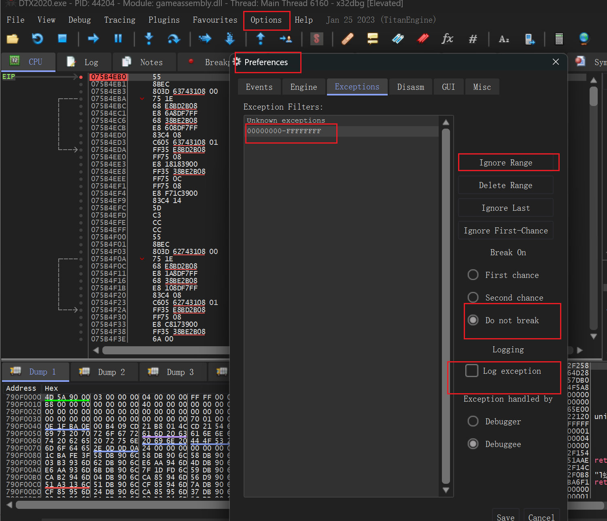
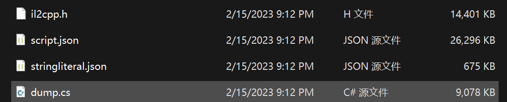
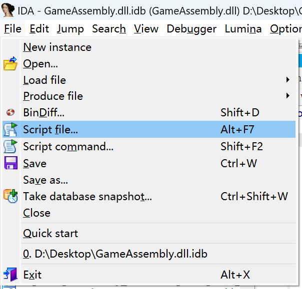

# Unity

## Il2CppDumper

需要

1. 可执行文件。PC平台是`GameAssembly.dll` or `*Assembly.dll`，移动端是`libil2cpp.so`
2. 一个`global-metadata.data`文件

最后自动生成到当前目录下。

现在可以使用`ILspy`、`dnspy`等工具打开dll

<https://blog.csdn.net/inter315/article/details/125382599>

IDA 随后读取GameAssembly（不是解包后的），然后输入从dnspy获得的RVA，可以定位到根据汇编代码生成的伪代码。

xdbg等工具找到运行时函数地址是根据`GameAssembly.dll`的模块地址（基地址）+RVA地址获得到的当前物理地址。

### xdbg

Symbols模块看基址

CPU模块右键Go to -\> Expression 输入计算后的函数地址 （Ctrl+G快捷键）

#### 屏蔽异常

## IDA

`G` 跳转到地址

`Ctrl+ALT+K` 修改指令（Key-Patch-\>Patcher）

结合`il2CppDumper`

它除了`DummyDll`文件还会生成

其中`ida_with_struct_py3.py`脚本可以使用`ida`运行，选择`script.json`，然后选择`il2cpp.h`头文件，运行后IDA将会补全函数名

