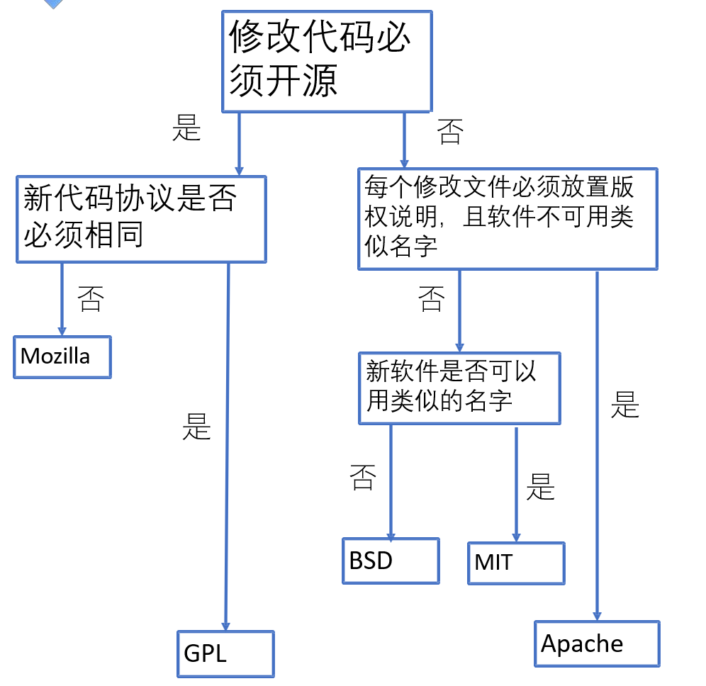
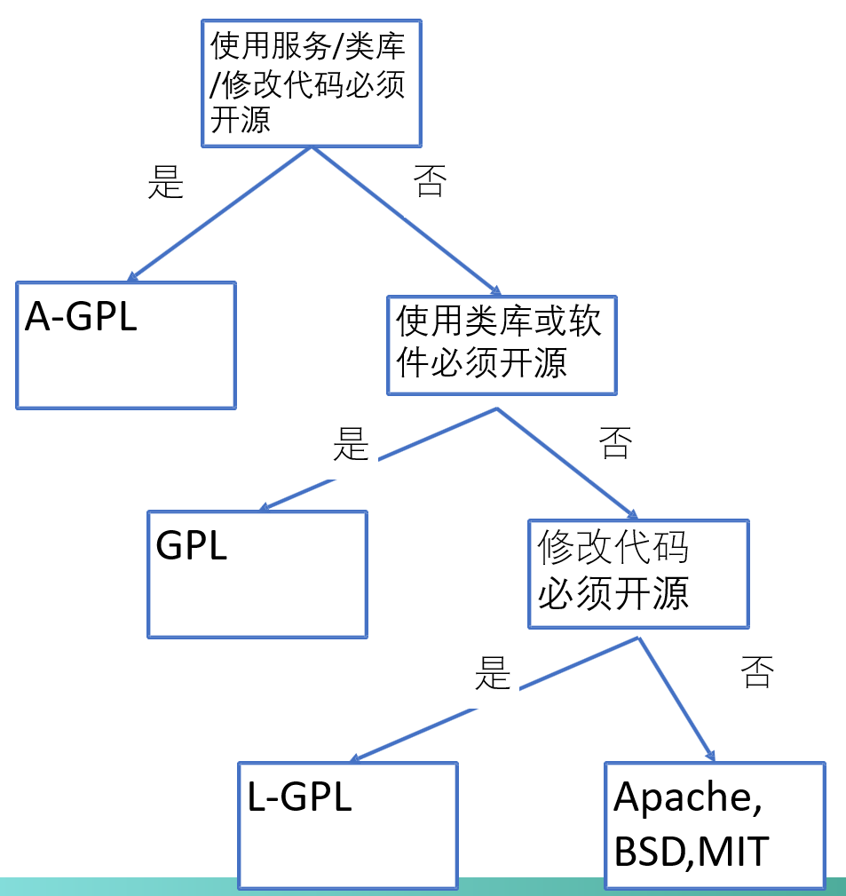

# Git

## 概念

##### ref

A remote ref is a reference (pointer) to a branch, tag, or other object in a remote repository. For example, if you clone a repository from git.ourcompany.com, you will have a remote ref named origin/master that points to the master branch on the remote server. You can use remote refs to fetch, push, or pull data from the remote repository. You can also use them to track the state of the remote repository and compare it with your local repository.

## 开始新项目

拿到git地址和权限后，选择本地电脑中一个文件夹，使用 `git init` 在当前目录新建一个`.git`目录，然后进行`git pull` 拉取代码。

### 分支

```bash
git branch -a #查看本地和远程的所有分支
git branch -r #查看远程分支
git checkout -b dev origin/dev #创建本地分支dev并关联到远程origin/dev分支
git checkout dev #切换到dev分支进行开发
git branch -vv #查看本地分支和远程分支的关联关系
```

### 将本地代码关联到远程分支

```bash
git init
git add .
git commit -m "first commit"
git branch -M main 
# 更改当前分支名为main。-M是--move 和 --force的结合
# -M是即使已存在相应的分支名也可以重命名分支。而-m则更宽松


git remote add origin https://github.com/Euynac/IntelligentTowerUI.git
git push -u origin main
# 这里-u是--set-upstream的简写，其主要用途是在推送代码的同时，将本地分支与远程分支建立起关联关系。
# 这里就是将本地的main分支与远程的origin/main分支建立关联
# 下次再在本地mian分支进行push时，可以直接简化写为git push

```

### 提交


```bash
git diff # 然后查看冲突的原因
git status # 查看当前修改以及新增的未track的
git add . # 提交到缓冲区，未track的也track
git commit -m 描述 # m是message，提交到本地仓库
git push 远程仓库名 本地分支名:远程分支名 # 提交到远程仓库。本地分支名写HEAD是指当前本地工作的分支指针
# 其中远程仓库名在git remote add origin时设置，所以一般就是origin
# 如果不指明远程分支名，那么默认推送到远程仓库的与本地分支名一样的分支
```


### 设置代理

```bash
git config --global http.proxy # 查看当前设置的代理
git config --global http.proxy socks5://127.0.0.1:1080 # 设置代理为sock5（可换为http等），设置后同样作用于vs的git
git config --global --unset http.proxy # 移除代理
```


### Git提交时用错了用户名

[GIT提交时用错了用户名-hanwei_1049-ChinaUnix博客](http://blog.chinaunix.net/uid-13746440-id-5586437.html)

```bash
# 1. configure your new username and email
# change username The format of the username in Git is configurable and can be set to either "username.user" or "user.name"
git config username.user <username>
# change email
git config username.email <email>

# 获取配置
git config username.user

#2 run this command.This Git command will amend the previous commit with the current changes and reset the author to the original author of the commit. The -C HEAD option specifies that the commit message should not be changed and the --reset-author option resets the author to the original author of the commit.
git commit --amend -C HEAD --reset-author

#3 run this command
git push --force
```

#### 批量修改提交的用户名

```shell
#!/bin/sh

git filter-branch --env-filter '
OLD_EMAIL="your-old-email@example.com"
CORRECT_NAME="Your Correct Name"
CORRECT_EMAIL="your-correct-email@example.com"
if [ "$GIT_COMMITTER_EMAIL" = "$OLD_EMAIL" ]
then
    export GIT_COMMITTER_NAME="$CORRECT_NAME"
    export GIT_COMMITTER_EMAIL="$CORRECT_EMAIL"
fi
if [ "$GIT_AUTHOR_EMAIL" = "$OLD_EMAIL" ]
then
    export GIT_AUTHOR_NAME="$CORRECT_NAME"
    export GIT_AUTHOR_EMAIL="$CORRECT_EMAIL"
fi
' --tag-name-filter cat -- --branches --tags
```

[git - How do I change the author and committer name/email for multiple commits? - Stack Overflow](https://stackoverflow.com/questions/750172/how-do-i-change-the-author-and-committer-name-email-for-multiple-commits)

###### 不修改历史来将错误的用户/邮箱关联上

使用`mailmap`特性，在git仓库根目录下创建`.mailmap`文件，然后可以使用`git shortlog`功能看看是否关联正确。

[gitmailmap(5) (htmlpreview.github.io)](https://htmlpreview.github.io/?https://raw.githubusercontent.com/newren/git-filter-repo/docs/html/gitmailmap.html)

```mailmap
Proper Name <proper@email.xx> Commit Name <commit@email.xx>
```

但似乎对Gitlab不管用。

不过可以通过[github.com/newren/git-filter-repo/](https://github.com/newren/git-filter-repo/)该工具，通过编写的`mailmap`文件，自动应用`filter-branch`命令

```shell
git filter-repo --mailmap git-mailmap
```

[git - How do I change the author and committer name/email for multiple commits? - Stack Overflow](https://stackoverflow.com/questions/750172/how-do-i-change-the-author-and-committer-name-email-for-multiple-commits/9491696#9491696)


### .gitingore不生效

因为如果已经先前加入了git管理的文件，则再添加`.gitingore`则无效，仍然会被追踪changes。

可以使用

`git rm --cached filename` 删除追踪的缓存文件，来结束追踪。

如果缓存太多要删除的，可以使用

`git rm -r --cached .` 全部删除再 `git add .`加回tracing，这时候则会遵守.gitingore的规则去添加tracing。

最后`git commit -m ".gitignore is now working"`

### Fork后使用原项目未merge的pull request 应用到自己Fork的分支

[stackoverflow.com/questions/6022302/how-to-apply-unmerged-upstream-pull-requests-from-other-forks-into-my-fork](https://stackoverflow.com/questions/6022302/how-to-apply-unmerged-upstream-pull-requests-from-other-forks-into-my-fork)

You can also do this via the github webpage.

I assume, you should have already a fork (MyFork) of the common repo (BaseRepo) which has the pending pull request from a fork (OtherFork) you are interested in.

1.  Navigate to the fork (OtherFork) which has initiated the pull request which you like to get into your fork (MyFork)
2.  Go to the pull requests page of OtherFork
3.  Click new pull request
4.  The pending pull request(s) should be offered. Remember to select proper OtherFork branch too. Select on the left side as the base fork your fork (MyFork) (**IMPORTANT**).
5.  Now the option of View pull request should change to Create pull request. Click this.

Now you should have a pending pull request in your fork (MyFork), which you can simply accept.

# 开源协议


