# Microsoft Office

## Wildcard（通配符）

查找：

`([A-Z][0-9]{1,3})` 这种操作类似于正则，可以进行匹配，括号为捕获组

替换：

`\1` 为第一捕获组

`^&` 为所有内容

## Word

按一下空格就能回到光标所在位置

`Shift+F5`就能回到上一次编辑位置

### 打勾打叉

打勾：输入`2611`后，选中按`ALT+X`。打叉输入`2612`

### 添加题注

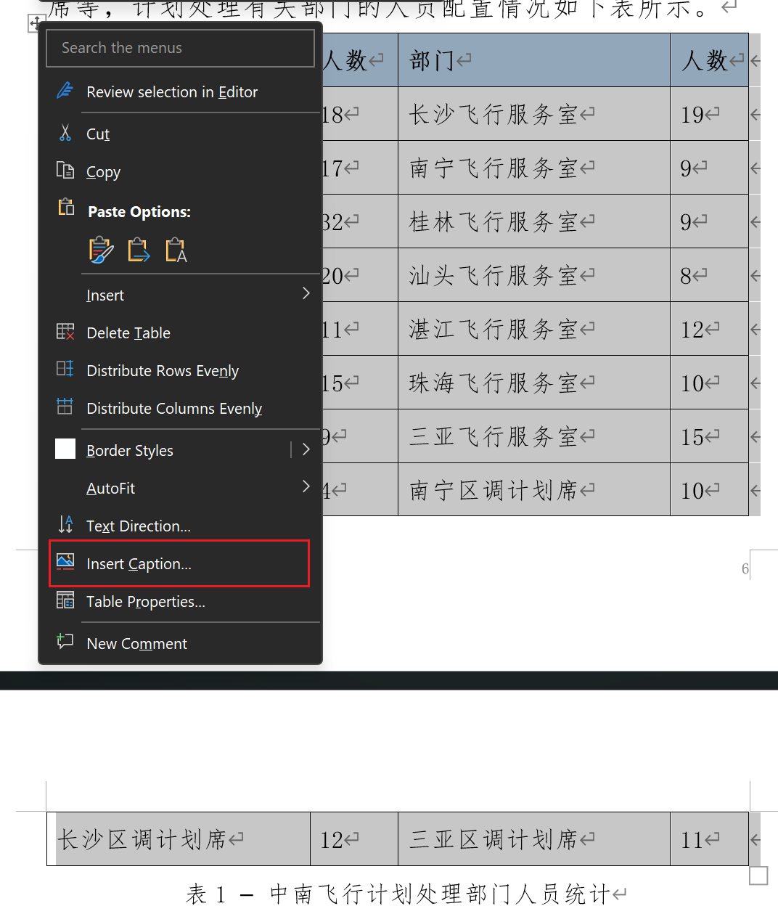

输入表标题后，再调整。可以使用题注样式

### 粘贴图片后被文字挡住

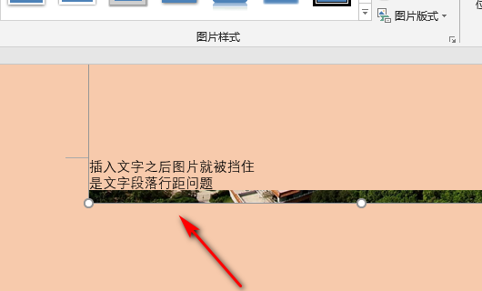

将该段落或整个文档的行距进行修改，改成1.5倍行距，就会发现图片神奇的正常了。

### 调整Tab缩进

中文一般都是2字符缩进（`2ch`）

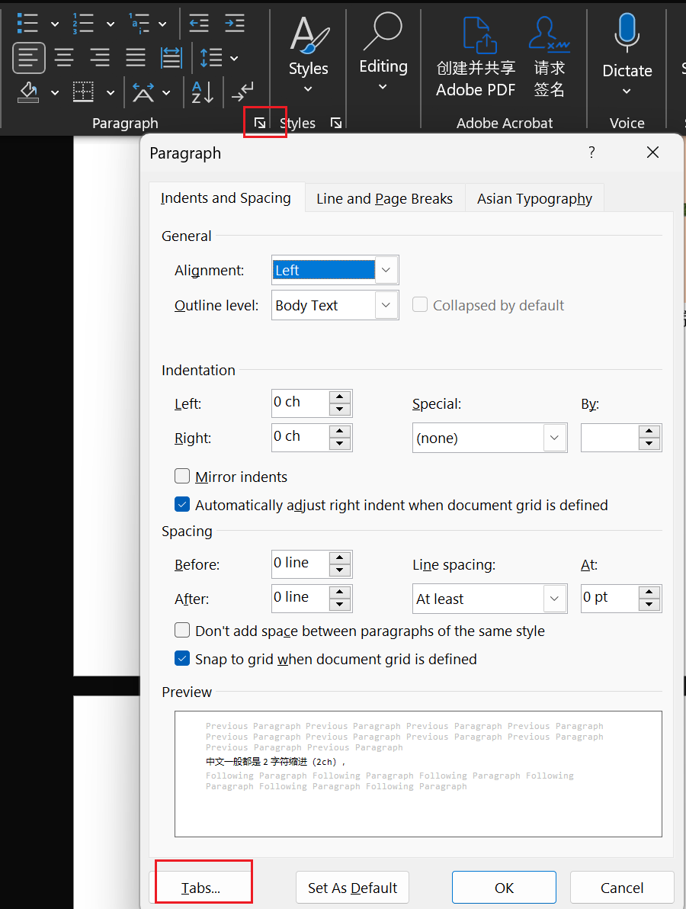

### 段落缩进的坑

如果`Left`改成0，而`First line`改为`2ch`（2个字符），则会自动的变为`Left+悬挂缩进`等，造成问题。这应该是`Word`的`BUG`，要强制不要让它转换为上述相加，而是强行保留`2ch`。

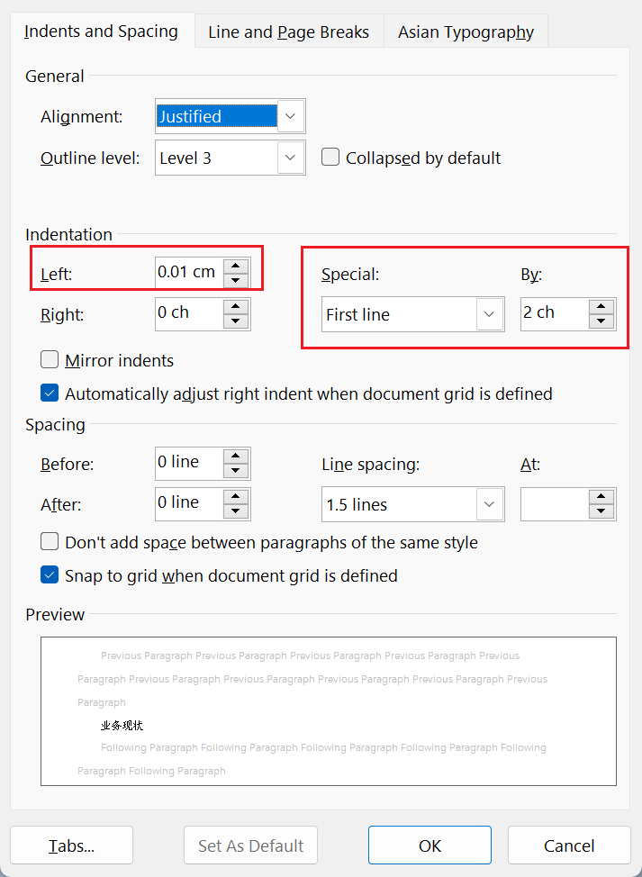

### 调整编号缩进

1. 右键编号的数字-调整列表缩进。  
   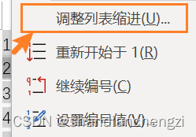  
2. 编辑格式-编号。  
   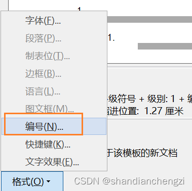  
3. 点击更多，选择编号之后制表符，并设置制表符的位置，就可以调整间距了。  
   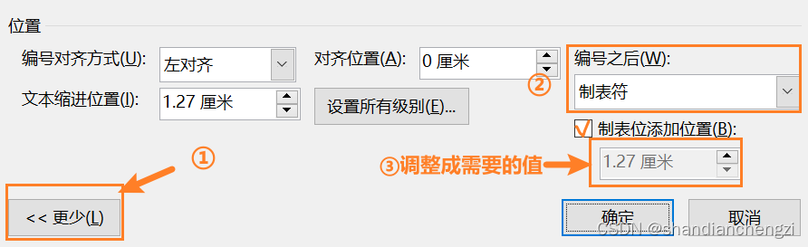

会自动应用到所选的样式中，如果开启了自动更新的话。

另外，编号点击之后，浅色部分是可能加多了东西，深色部分是字符本身spacing？需要调深色要用字体功能里面的调字体缩进

### 多级样式

定义样式的时候，无法定义多级样式，因为多级样式是在另一个地方定义的：

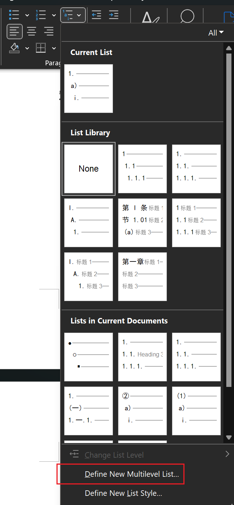

传统的样式定义的只能是一级，然后多级样式通过多级列表的链接来实现：

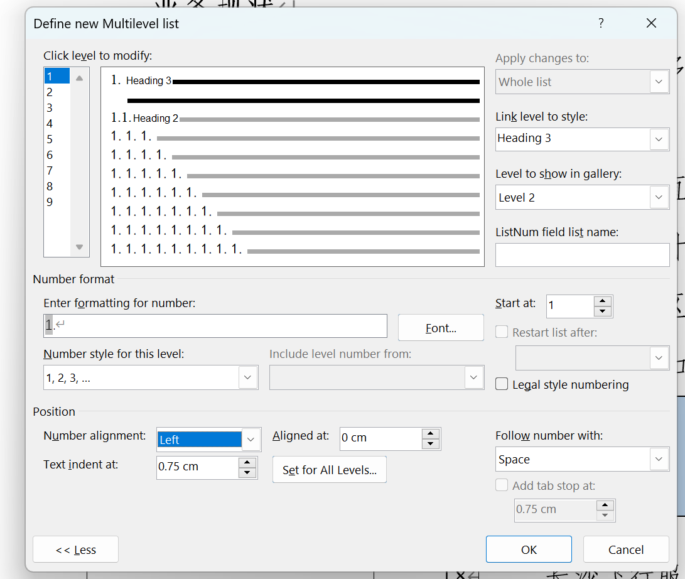

然后多级列表样式就会更新到样式库中

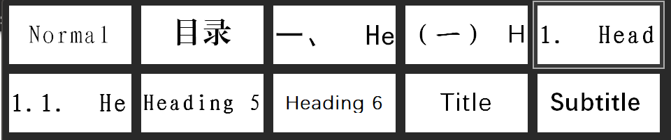

## PPT

### 隐藏指定Component

使用"选择"窗格管理对象，快捷键`ALT+F10`

## Excel

### 删除多行

删除行快捷键`ctrl+"-"`，选中多行要选择行元素而不是整个行，否则无法删除

### 统计重复出现次数 COUNTIF

日常工作中，经常需要统计`Excel`某行或某列，特定内容出现的次数，`Excel`为用户提供了一个很好的`COUNTIF`统计函数，通过该函数可以轻松统计出特定内容在该列出现的总数或出现第几次。

1. `COUNTIF`函数介绍

`COUNTIF`函数可以统计单元格区域中满足给定条件的单元格的个数，该函数的语法结构为：`COUNTIF(rage,criteria)`，其参数`range`表示需要统计其中满足条件的单元格数目的单元格区域；`criteria`表示指定的统计条件，其形式可以为数字、表达式、单元格引用或文本，如：`COUNT(B2:B5,B2)` 意思为统计`B2:B5`这个范围内，`B2`特定内容出现的次数。

2. 举例说明

   2.1. 统计特定内容出现总数

   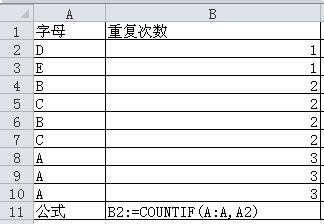

   通过公式：`COUNTIF(A:A,A2)`就可以统计出`A2`，在`A`列出现的总次数，其中：`A:A`为范围，`A2`为指定内容。

   2.2. 统计特定内容出现的次数

   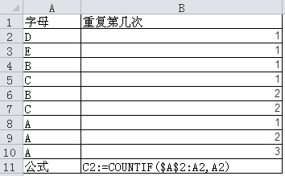

   通过公式：`COUNTIF($A$2:A2,A2)`就可以统计出`A2`，在`A`列中出现第几次。其中：`$A$2:A2`为指定范围，`$`符号表示锁定，通过下拉的过程，该值不会随列数变化而变化，`A2`为特定内容。这样就可以轻松知道`A2`在`A`列中第几次出现。如果每天都往该工作表中汇总新数据，你想删除之前的重复内容，这时候你就可以筛选，重复出现次数最小的进行删除。

### 换行

换行可以采用`alt+enter`键入。

替换的时候，替换栏中需要按住`ALT` ，小键盘输入 `10`

### 转置表格

复制后粘贴，选择转置
