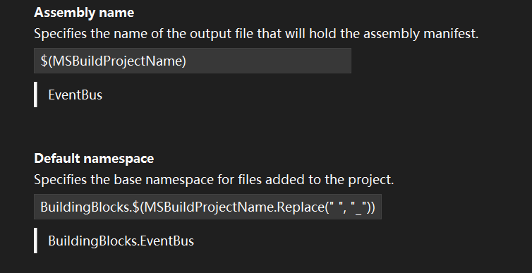
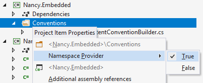

# ReSharper

### 问题

#### prop template
`prop`有非常奇怪的问题，转而使用VisualStudio的比较好。

> 其实原因发现居然是VS自己的IntelliCode，关闭C# suggestioins.
> 又发现一个解决方案，可以开启IntelliCode，但是选择 `Apply whole line completions on right arrow`

ReSharper > Tools > Template Explorer

### 配置

Shortcut Scheme中可以开启Shortcut Browser，按三下Ctrl快速弹出当前支持的快捷键。

如果发现对不上快捷键，需要去Keyboard配置中重新覆盖一下配置。

### File Layout
其中有功能可以排序属性

应用File Layout需要使用

这个右键文件使用 `Cleanup Code…` 功能，注意不是VS的CleanupCode

按字母顺序排序属性：

### 快捷

#### 批量解决CS0246 引用未引入的错误

#### Alt+\` Navigate To

##### To-do explorer
需要在写了 `TODO` `BUG`等描述的地方进入
[Navigate To: To-do Explorer | ReSharper Documentation (jetbrains.com)](https://www.jetbrains.com/help/resharper/Navigation_and_Search__Navigate_from_Here__Todo_Explorer.html)

#### Alt+Insert Generate Code
[Generate type members | ReSharper Documentation (jetbrains.com)](https://www.jetbrains.com/help/resharper/2023.2/Generating_Type_Members.html)

#### Ctrl+Shift+Alt+方向键 快速移动参数/行顺序

MoveUp和MoveDown可能要重新设置一下

#### Alt+Enter 集大成

**Alt+Enter** 快速看看当前代码支持的功能，不仅是重构，还可以是直接转向接口实现等

如果直接输入word，还可以查找所有Action

比如输入

Nearby，启动转到文件附近文件功能

Regular，启动validate regular expression 功能

### Navigation

一定要设置的是TextEditor

ReSharper_GotoPrevMember

#### Quick Documentation （Ctrl+Shift+F1）

可以快速转到MSDN

## Code Snippets

ReSharper \| Tools \| Templates Explorer.

[jetbrains.com/resharper/features/code_templates.html](https://www.jetbrains.com/resharper/features/code_templates.html)

## Convenient Functions

### Complete Statement 快速加括号

This feature inserts necessary syntax elements (braces, semicolons etc.) and sets you in position to start the next statement, saving you from excessive juggling with the caret. As you work, keep in mind the default shortcut for this feature: **Ctrl+Shift+Enter**.

Complete Statement (also known as Smart Enter) comes to rescue in numerous scenarios, including auto-closing parentheses, adding semicolons, completing if, while and for statements, and so on.

### Namespace

By default, ReSharper assumes that the namespace each class appears in matches its location in the project. The 'root' namespace for the project is defined in the project properties:

项目内部的才会自动按照文件夹分namespace

