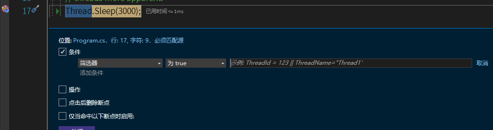
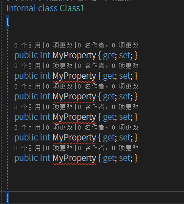

### 离线下载
##### 教程
[Create an offline installation - Visual Studio (Windows) | Microsoft Learn](https://learn.microsoft.com/en-us/visualstudio/install/create-an-offline-installation-of-visual-studio?view=vs-2022)

##### 下载bootstrapper vs_enterprise.exe
[Create a network-based installation - Visual Studio (Windows) | Microsoft Learn](https://learn.microsoft.com/en-us/visualstudio/install/create-a-network-installation-of-visual-studio?view=vs-2022#download-the-visual-studio-bootstrapper-to-create-the-layout)
```shell
# 使用哦 bootstrapper进行运行命令 create local layout
vs_enterprise.exe --layout D:\VS2022\vslayout --add Microsoft.VisualStudio.Workload.ManagedDesktop --add Microsoft.VisualStudio.Workload.NetWeb --add Microsoft.VisualStudio.Component.Git --includeRecommended --lang en-US zh-CN

# --lang在安装时无效
# --fix可以检验vslayout是否有包是损坏的


# 到内网机器下，一定要使用同一条命令安装，而且启动bootstrapper换成了vslayout里面的
D:\VS2022\vslayout\vs_enterprise.exe --noweb --add Microsoft.VisualStudio.Workload.ManagedDesktop --add Microsoft.VisualStudio.Workload.NetWeb --add Microsoft.VisualStudio.Component.Git --includeRecommended
# 指定路径安装：--installPath d:\VS2021
```


### CLI

Windows下设置dotnet cli工具语言为英文：`set DOTNET_CLI_UI_LANGUAGE=en`

Linux下设置系统语言为英文即可同步变为英文：`export LANG=en_US.UTF-8`

### 插件推荐

Debug Single Thread 多线程时单线程调试

Multiline Search and Replace 多行替换、搜索

#### SwitchStartupProject

能够保存不同的Startup Project的设置。
[SwitchStartupProject for VS 2022 - Visual Studio Marketplace](https://marketplace.visualstudio.com/items?itemName=vs-publisher-141975.SwitchStartupProjectForVS2022)

#### Better Comments VS2022

将指定格式的注释不同颜色高亮

#### Visual Commander

Visual Commander 可以用C\#编码设定强大的功能（类似于Word、PPT的宏）
[vlasovstudio.com/visual-commander/](https://vlasovstudio.com/visual-commander/)

复制当前行的行数及方法名到剪切板：
```cs
EnvDTE.TextSelection ts = DTE.ActiveWindow.Selection as EnvDTE.TextSelection;

if (ts == null)
  return;

EnvDTE.CodeFunction func = ts.ActivePoint.CodeElement[vsCMElement.vsCMElementFunction]
            as EnvDTE.CodeFunction;

if (func == null)
  return;

string result = DTE.ActiveWindow.Document.FullName + System.Environment.NewLine +
  "Line " + ts.CurrentLine + System.Environment.NewLine +
  func.FullName;

System.Windows.Clipboard.SetText(result);
```

#### Stack Trace Explorer

[Stack Trace Explorer 2022 - Visual Studio Marketplace](https://marketplace.visualstudio.com/items?itemName=SamirBoulema.StackTraceExplorer2022)

可以将粘贴进的Stack Trace高亮并启动路由功能
其实来源于ReSharper，默认快捷键为 `Ctrl+E,T`
当前插件的快捷键去这里看View - Other Windows - Stack Trace Explorer

实测不如ReSharper的。

### 注释高亮

以BUG开头的注释会高亮

另外还可以安装Better Comments插件

### 语法高亮

#### 正则

三种方式让正则表达式高亮
```cs
// language=regex

var str = @"[A-Z]\d+";

MyMethod(/* language=regex */ @"[A-Z]\d+");


```

不过目前不支持\$”{}”，只能是纯string

.NET 7新增方法上的正则高亮支持

https://devblogs.microsoft.com/dotnet/regular-expression-improvements-in-dotnet-7

```cs
void MyMethod([StringSyntax(StringSyntaxAttribute.Regex)] string regex);
```


### Enable and disable package restore in Visual Studio

[NuGet Package Restore | Microsoft Learn](https://learn.microsoft.com/en-us/nuget/consume-packages/package-restore#enable-and-disable-package-restore-in-visual-studio)

### Code Intelligence

[Visual Studio keyboard shortcut to display IntelliSense - Stack Overflow](https://stackoverflow.com/questions/3640544/visual-studio-keyboard-shortcut-to-display-intellisense)

### StackTrace

When you instantiate the StackTrace, use the following:

`StackTrace callStack = new StackTrace(1, true);`

The "true" parameter is telling it to include such things as LineNumbers, etc.

PDB can be generated for Release as well as for Debug.

Project → Properties → Build → Advanced → Debug Info

### Multiple startup project

In Solution Explorer, select the solution (the top node).

Choose the solution node's context (right-click) menu and then choose Properties. The Solution Property Pages dialog box appears.


Solution Property Pages

Expand the Common Properties node, and choose Startup Project.

Choose the Multiple Startup Projects option and set the appropriate actions.

### 反编译

ILSpy

针对VS自带反编译方案的不足,这里推荐使用ILSpy,通过VS扩展市场[Extensions for Visual Studio family of products | Visual Studio Marketplace](https://marketplace.visualstudio.com/vs)离线下载,安装成功后在VS`工具->ILSpy`打开,然后通过菜单栏定位到要查看的程序集,打开后可查看程序集的结构,命名空间,类等所有对象的定义与源码

如果想阻止别人反编译你的源码,可为你的程序集加上SuppresslIdasmAttribute属性

# 调试

### 设置

Ctrl+ALT+E打开Exception Setting，这里设置Debug时是否捕捉异常并停止提示。

比如一些异步的方法、Task中引发的异常，默认是不捕获异常的，需要将Common Language Runtime Exception勾上。

**多进程调试**

In Visual Studio you can set multiple startup projects to run/debug two projects at once:

Right click on the solution in the Solution Explorer and select Properties.

Under Common Properties\\Startup Project select Multiple startup projects and set the Action to be Start for the two projects that you want to debug.

解决方案属性-\>多个启动项目


### 即时调试

-   即时调试窗口:命中断点后[Ctrl+D+I]

    可输入参数,实例化对象,常量,也可执行方法或函数

    

-   特殊参数
    -   \$retrunValue:方法返回值
    -   \$exception:未捕获的异常

        

### 多线程调试

安装Debug Single Thread插件仅调试单个线程。

-   三个调试操作窗口
    -   线程[Ctrl+Shift+H]
    -   并行堆栈
    -   并行监视[Ctrl+Shift+D]
-   三种操作方法
    -   标记
        标记线程后,在并行监视窗口中显示标记线程,其他线程如果无断点则不会跳进

    -   冻结
        冻结线程后停止工作,此方法不适用于有多线程同步操作的

    -   添加断点
        -   条件表达式:参数
        -   筛选器:线程名称或者线程Id

            

### 远程测试调试

测试-\>测试资源管理器

-   Docker Desktop:基于WSL/WSL2
    -   Windows
    -   Linux
-   WSL/WSL2
    -   Ubuntu
    -   其他Linux发行版
-   SSH
-   远程Windows
-   远程Linux

    

# 快捷操作

所有快捷键均可在工具-\>选项-\>键盘中自定义

注意，它还区分优先级，即，Global优先级最小，其次是各个子窗口。如果子窗口有相应的设置，则Global的可能导致无效，注意检查。

代码窗口是Text Editor 而不是C\# Editor

### 个人定义

Alt + C Collapse all (在Solution Explore界面)

默认快捷键 `Ctrl+[,S` （个人建议改成Ctrl+W，Ctrl+W，表示Where）

#### Resharper相关

Ctrl + R , C Change Signatrue (TextEditor)

Ctrl + Arrow Down ReSharper_GotoPrevMember (TextEditor)

### 代码操作

Ctrl+F12 Go to Implementation（转到接口实现）.

## 切换

Ctrl+Tab 快速在已打开的文件中切换

## W类窗口

Window类所以先按W

打开错误列表 Ctrl+W, E (ErrorList)

打开解决方案窗口Ctrl+W, S (Solution)

打开输出窗口Ctrl+W, O (Output)

Git Changes窗口建议改为Ctrl+W, G (Git)

Package Manage Console建议改为Ctrl+W, C (Console)

Bookmark窗口 Ctrl+W, B (Bookmark)

## K类代码

### Intelligence

列出当前可选成员 Ctrl+K, L (List)

当前快速信息（比如出现红线、蓝线等有提示，一般要用鼠标移上去的） Ctrl+K, I (Info)

### 注释

注释当前行/选中行 Ctrl+ K, C (Cancel)

取消注释Ctrl+K, U (Undo cancel)

### 格式化

格式化当前行/选中行：Ctrl + K, F (Format)

格式化当前文档：Ctrl + K, D (Document)

### 书签

书签设置在行号上，而不是代码上。 如果修改代码，书签会保留在行号上，不会随代码移动。

当前行设置/删除书签 Ctrl+K, K

转到下一个书签 Ctrl + K, N (Next)

## 其他

### 全文搜索

[] 默认快捷键 Ctrl+T(Go To) 可根据文件名称,类名称,方法名称全搜索


### 快速定位活动文件

[] 默认快捷键 Ctrl+[,S （个人建议改成Ctrl+W，Ctrl+W，表示Where）


### 多行编辑

-   Alt+鼠标拖选
    -   Alt+Shift+方向键

        

### 多光标同时编辑

Ctrl+Alt+鼠标点击要编辑的位置


### 整行上下移动

Alt+上下方向健


整个方法块折叠以后也可以上下移动

### 历史粘贴

Ctrl+Shift+V 打开粘贴板历史内容,点击粘贴


# ReSharper

### 配置

Shortcut Scheme中可以开启Shortcut Browser，按三下Ctrl快速弹出当前支持的快捷键。

如果发现对不上快捷键，需要去Keyboard配置中重新覆盖一下配置。

### 快捷

#### Ctrl+Shift+Alt+方向键 快速移动参数/行顺序

MoveUp和MoveDown可能要重新设置一下

#### Alt+Enter 集大成

**Alt+Enter** 快速看看当前代码支持的功能，不仅是重构，还可以是直接转向接口实现等

如果直接输入word，还可以查找所有Action


比如输入

Nearby，启动转到文件附近文件功能

Regular，启动validate regular expression 功能

### Navigation


一定要设置的是TextEditor

ReSharper_GotoPrevMember

#### Quick Documentation （Ctrl+Shift+F1）

可以快速转到MSDN


## Code Snippets

ReSharper \| Tools \| Templates Explorer.

[jetbrains.com/resharper/features/code_templates.html](https://www.jetbrains.com/resharper/features/code_templates.html)

## Convenient Functions

### Complete Statement 快速加括号

This feature inserts necessary syntax elements (braces, semicolons etc.) and sets you in position to start the next statement, saving you from excessive juggling with the caret. As you work, keep in mind the default shortcut for this feature: **Ctrl+Shift+Enter**.

Complete Statement (also known as Smart Enter) comes to rescue in numerous scenarios, including auto-closing parentheses, adding semicolons, completing if, while and for statements, and so on.

### Namespace

By default, ReSharper assumes that the namespace each class appears in matches its location in the project. The 'root' namespace for the project is defined in the project properties:


项目内部的才会自动按照文件夹分namespace


