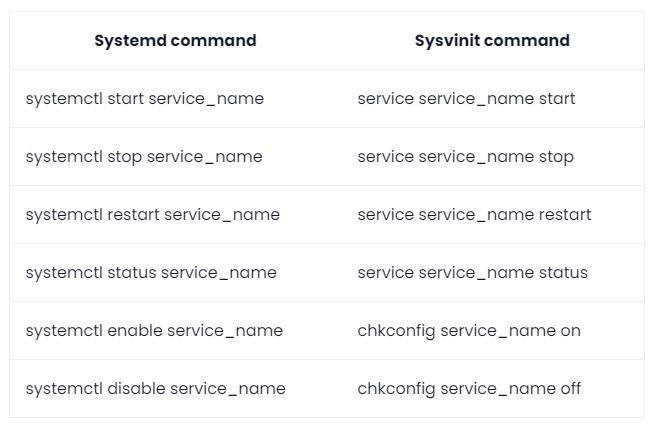

# WSL

可以通过windows terminal的配置，将启动目录改到与运行目录相同，方便直接使用linux相关工具

## 文件管理
可以直接在windows按下面的方式访问：
`\\wsl$`
`\\wsl.localhost\kali-linux\root`

## 命令

<https://docs.microsoft.com/zh-cn/windows/wsl/basic-commands>

|                                                                                                           |                                                                                                                                                                                                                                                                       |
|-----------------------------------------------------------------------------------------------------------|-----------------------------------------------------------------------------------------------------------------------------------------------------------------------------------------------------------------------------------------------------------------------|
| wsl --list --online                                                                                       | 列出可用的linux发行版                                                                                                                                                                                                                                                 |
| wsl --install -d kali-linux                                                                               | 下载kali-linux并安装启动                                                                                                                                                                                                                                              |
| wsl --shutdown                                                                                            | 终止所有子系统                                                                                                                                                                                                                                                        |
| wsl --terminate docker-desktop-data                                                                       | 终止指定的子系统, 如 docker-desktop-data                                                                                                                                                                                                                              |
| wsl --export docker-desktop-data F:/WSL/docker-desktop-data/docker-desktop.tar                            | 将子系统导出为tar包                                                                                                                                                                                                                                                   |
| wsl --unregister docker-desktop-data                                                                      | 使用wsl命令注销并删除子系统                                                                                                                                                                                                                                           |
| wsl --import docker-desktop-data F:/WSL/docker-desktop-data F:/WSL/docker-desktop-data/docker-desktop.tar | 重新导入子系统到指定目录，然后tar包可以删除了                                                                                                                                                                                                                         |
| wsl -l -v                                                                                                 | 列出当前安装的wsl列表，以及版本信息                                                                                                                                                                                                                                   |
| cat /etc/resolv.conf \| grep nameserver                                                                   | WSL 每次启动的时候都会有不同的 IP 地址，所以并不能直接用静态的方式来设置代理。WSL2 会把 IP 写在 /etc/resolv.conf 中                                                                                                                                                   |
| wsl -d(--distribution) \<Distribution Name\> --user \<User Name\>                                         | 若要通过特定用户运行特定 Linux 发行版，请将 \<Distribution Name\> 替换为你首选的 Linux 发行版的名称（例如 Debian），将 \<User Name\> 替换为现有用户的名称（例如 root）。 如果 WSL 发行版中不存在该用户，你将会收到一个错误。 若要输出当前用户名，请使用 whoami 命令。 |
| wsl --set-default \<Distribution Name\>                                                                   | 设定默认打开的Linux发行版                                                                                                                                                                                                                                             |

## WSL连接宿主机代理

<https://zinglix.xyz/2020/04/18/wsl2-proxy/>


#### 新版配置
新版本WSL遇到问题的：wsl: 检测到 localhost 代理配置，但未镜像到 WSL。NAT 模式下的 WSL 不支持 localhost 代理
[Accessing network applications with WSL | Microsoft Learn](https://learn.microsoft.com/en-us/windows/wsl/networking#auto-proxy)

https://github.com/microsoft/WSL/issues/10753#issuecomment-2041372912


在Windows用户根目录新建`.wslconfig`文件
```config
[wsl2]
networkingMode=mirrored
dnsTunneling=true
firewall=true
autoProxy=true


[experimental]
# requires dnsTunneling but are also OPTIONAL
bestEffortDnsParsing=true
useWindowsDnsCache=true
autoMemoryReclaim=gradual  # gradual  | dropcache | disabled

```
然后`wsl --shutdown`关闭后重启wsl

#### 脚本


```shell
#!/bin/sh
hostip=$(cat /etc/resolv.conf | grep nameserver | awk '{ print $2 }')
wslip=$(hostname -I | awk '{print $1}')
port=<PORT> # 需要自行更改为proxy端口

PROXY_HTTP="http://${hostip}:${port}"
set_proxy(){
    export http_proxy="${PROXY_HTTP}"
    export HTTP_PROXY="${PROXY_HTTP}"
    export https_proxy="${PROXY_HTTP}"
	export HTTPS_PROXY="${PROXY_HTTP}"
git config --global http.proxy "${PROXY_HTTP}"
git config --global https.proxy "${PROXY_HTTP}"
}
# python如果无效的话，就在python执行的命令后加 --proxy=http://xxxxx吧
unset_proxy(){
    unset http_proxy
    unset HTTP_PROXY
    unset https_proxy
	unset HTTPS_PROXY
git config --global --unset http.proxy
git config --global --unset https.proxy
}


test_setting(){
    echo "Host ip:" ${hostip}
    echo "WSL ip:" ${wslip}
    echo "Current proxy:" $https_proxy
}

if [ "$1" = "set" ]
then
    set_proxy
elif [ "$1" = "unset" ]
then
    unset_proxy
elif [ "$1" = "test" ]
then
    test_setting
else
    echo "Unsupported arguments."
fi

alias proxy="source /xxx/proxy.sh"
```

另外可以在 `~/.bashrc` 中选择性的加上下面两句话，记得将里面的路径修改成你放这个脚本的路径。

```shell
alias proxy="source /xxx/proxy.sh" # 可以为这个脚本设置别名 proxy，这样在任何路径下都可以通过 proxy 命令使用这个脚本了，之后在任何路径下，都可以随时都可以通过输入 proxy unset 来暂时取消代理。

/xxx/proxy.sh set # 在每次 shell 启动的时候运行该脚本实现自动设置代理，这样以后不用额外操作就默认设置好代理啦~
```

注意，这代理不适用于某些不关注系统环境变量的程序，比如apt，firefox等。

默认情况下，WSL2是无法ping通HOST的，但能ping通宿主机，需要设置相应的防火墙规则使其支持ping通HOST。

如若遇到vEthernet 无法连接互联网的情况，可以通过联通主机的代理进行外网访问。

解决方案是直接重启电脑。猜测是hype-v的端口随机占用有概率导致无法连接问题

## 问题

### zsh语法高亮非常慢

输入第一块命令的时候，WSL2的zsh语法高亮特别慢，通过排查 `~/.zshrc`可以发现是`zsh-syntax-highlighting.zsh`的问题，遂上Github发现问题：
[syntax highlighting is super slow in WSL2 · Issue #790 · zsh-users/zsh-syntax-highlighting (github.com)](https://github.com/zsh-users/zsh-syntax-highlighting/issues/790)

其中有一个临时解决方案，禁用掉某个wsl2的功能（似乎是可以将windows的环境变量运用到wsl中，这也导致docker之类的用不了了）。

I solved this by excluding windows directories from `$PATH` by adding following in `/etc/wsl.conf`. Create the file if it doesn't exist

```
[interop]
appendWindowsPath = false
```

Then restart wsl with

```sh
wsl --shutdown
```
#### 添加需要的windows程序到环境变量

注意大小写
```zshrc
path+=( 
/mnt/c/Users/lesmo/AppData/Local/Microsoft/WindowsApps /mnt/c/Users/lesmo/AppData/Local/Programs/Microsoft VS Code/bin /mnt/c/Program Files/Docker/Docker/resources/bin /mnt/c/ProgramData/DockerDesktop/version-bin /mnt/c/WINDOWS 
)
```


# Kali

## 安装


```shell
wsl --update
wsl --install -d kali-linux

# 安装好后会新建用户，但不能是root
sudo su # 然后切换到root用户，用本用户密码
passwd root # 修改root用户密码
```

<https://blog.csdn.net/tabactivity/article/details/125875242> 桌面版

`locale` 可以查看当前配置的语言环境

dpkg-reconfigure locales

下载语言包，默认Debian的语言包不是UTF-8格式的，所以中文会显示乱码。

可以下载英文UTF-8语言包，也能显示中文

默认JAVA安装在/usr/lib/jvm/目录下
### python环境

用Kex的包安装全套kali后，已经带有python3与python2，
默认`python`指向python3，而python2并不带`pip`

因此还要进行pip2的安装：
`wget https://bootstrap.pypa.io/pip/2.7/get-pip.py`

当分不清pip时，可以采用该命令：
`python2 -m pip ` 进行调用pip

### 问题

#### libcrypt.so.1: cannot open shared object file when upgrading from Stretch to Sid

<https://www.mail-archive.com/debian-bugs-dist@lists.debian.org/msg1818037.html>

```shell
$ cd /tmp
$ apt -y download libcrypt1
$ dpkg-deb -x libcrypt1_1%3a4.4.25-2_amd64.deb  .
$ cp -av lib/x86_64-linux-gnu/* /lib/x86_64-linux-gnu/
$ apt -y --fix-broken install
```

#### linux vim 上下左右只会出现ABCD

``` sh
$sudo apt-get remove vim-common
$sudo apt-get install vim
```

#### System has not been booted with systemd as init system
原因是你想用systemd命令来管理Linux上的服务，但你的系统并没有使用systemd，（很可能）使用的是经典的SysV init（sysvinit）系统。可以使用等效的命令：



## Kex

基于Windows WSL的一个kali linux GUI界面。

To switch to Windows when using Win-KeX in window mode, you can press the **F8** key to open the client's context menu, which allows you to manage the client sessions, such as closing the client, switching between full screen and window, etc. You can disconnect from active sessions by pressing **F8** -> **Exit viewer**, this will close the client but leave the session running in the background. You can re-connect to a session by typing `kex --win --start-client`¹.

I hope that helps!

Source: Conversation with Bing, 6/30/2023

> (1) Win-KeX Window Mode | Kali Linux Documentation. https://www.kali.org/docs/wsl/win-kex-win/.
> (2) Win-KeX | Kali Linux Documentation. https://www.kali.org/docs/wsl/win-kex/.
### 问题

#### root似乎不是真正的root，某些仍需要sudo

使用su之后，发生了微小的变化。

通过echo \$PATH可以证明两者不是同一个账户（？

这就导致了很多蜜汁问题。

比如如果不使用sudo kex去启动kex，是无法打开火狐浏览器的

不同的环境变量。

用的不同的bash和zsh造成的问题。

#### VNC问题

VNC是用来连接虚拟桌面的，Linux端用vncserver，然后windows端用vnc client去连接。

出现了一个黑屏问题...
发现用esm模式连不上，是黑屏。
可以去wsl里用`sudo kex`连上（这是windows模式），很奇怪。

记录下vnc的几个命令：

```sh
# 如果不用，删除该目录可能出现 Device or resource busy 的问题
umount /tmp/.X11-unix

# 删除vnc临时文件
sudo rm -rf /tmp/.X11-unix

# 尝试启动一个新 vnc 会话
vncserver

# 查看当前所有会话
vncserver -list

# 移除第几个会话
vncserver -kill :1

# 重新设置vnc密码
vncpasswd 
```


# MyLinux

## 基于Docker

把docker镜像当作linux虚拟机来使用

```dockerfile
FROM centos:7
RUN yum install -y vim bash-com* openssh-clients openssh-server iproute cronie net-tools wget
RUN yum group install -y "Development Tools"
RUN yum clean all
RUN localedef -c -f UTF-8 -i zh_CN zh_CN.UTF-8 && ln -sf /usr/share/zoneinfo/Asia/Shanghai /etc/localtime
ENV LANG=zh_CN.UTF-8
docker build . -t mylinux
docker run -it -d -p 6666:22 --hostname mylinux1 --name mylinux1 --privileged=true mylinux /usr/sbin/init
# 以特权模式进入可以使用systemctl命令（特权模式必须运行/sbin/init，用于启动dbus-daemon）
docker exec -it mylinux1 /bin/bash # 进入容器
passwd root # 输入两次强制设置弱密码
```

## 安装常用包

### kali
```sh
apt install wget # 可从Web下载文件
apt install net-tools
apt install dirsearch # web目录扫描
apt install hydra # web密码爆破
apt install libgmp-dev libmpc-dev libmpfr-dev # gmpy2 dependencies
apt install dos2unix # 常见shell脚本回车问题
```


### python

```sh
pip install PyCryptodome gmpy2 pwntools
```


## 安装自编译软件


```sh
# Git拉取，并编译需要的软件，比如bkcrack (源码其实可以拉去/usr/local/src大概)
cmake -S . -B build -DCMAKE_INSTALL_PREFIX=install
cmake --build build --config Release
cmake --build build --config Release --target install

# 在工作目录下install文件夹内有二进制可执行文件
# 一般来说自编译的软件放在/usr/local/bin 目录下
# 一定要使用绝对路径进行软链接，不然无法识别
ln -s /root/xxx/bkcrack/install/bkcrack /usr/local/bin

# 此时已经生效了，如果没生效检查一下环境变量作用范围是不是有那个/usr/local/bin
echo $PATH


```

## Linux命令手册
[jaywcjlove/linux-command: Linux命令大全搜索工具，内容包含Linux命令手册、详解、学习、搜集。https://git.io/linux (github.com)](https://github.com/jaywcjlove/linux-command)
轻松通过 `docker` 部署 `linux-command` 网站。

```shell
docker pull wcjiang/linux-command
```

```shell
docker run --name linux-command --rm -d -p 9665:3000 wcjiang/linux-command:latest
```


## 配置bash为zsh


```bash
chsh -s /bin/zsh
```

#### \~\/.zshrc

```sh
# ~/.zshrc file for zsh interactive shells.
# see /usr/share/doc/zsh/examples/zshrc for examples

setopt autocd              # change directory just by typing its name
setopt correct            # auto correct mistakes
setopt interactivecomments # allow comments in interactive mode
setopt magicequalsubst     # enable filename expansion for arguments of the form ‘anything=expression’
setopt nonomatch           # hide error message if there is no match for the pattern
setopt notify              # report the status of background jobs immediately
setopt numericglobsort     # sort filenames numerically when it makes sense
setopt promptsubst         # enable command substitution in prompt

WORDCHARS=${WORDCHARS//\/} # Don't consider certain characters part of the word

# hide EOL sign ('%')
PROMPT_EOL_MARK=""

# configure key keybindings
bindkey -e                                        # emacs key bindings
bindkey ' ' magic-space                           # do history expansion on space
bindkey '^U' backward-kill-line                   # ctrl + U
bindkey '^[[3;5~' kill-word                       # ctrl + Supr
bindkey '^[[3~' delete-char                       # delete
bindkey '^[[1;5C' forward-word                    # ctrl + ->
bindkey '^[[1;5D' backward-word                   # ctrl + <-
bindkey '^[[5~' beginning-of-buffer-or-history    # page up
bindkey '^[[6~' end-of-buffer-or-history          # page down
bindkey '^[[H' beginning-of-line                  # home
bindkey '^[[F' end-of-line                        # end
bindkey '^[[Z' undo                               # shift + tab undo last action

# enable completion features
autoload -Uz compinit
compinit -d ~/.cache/zcompdump
zstyle ':completion:*:*:*:*:*' menu select
zstyle ':completion:*' auto-description 'specify: %d'
zstyle ':completion:*' completer _expand _complete
zstyle ':completion:*' format 'Completing %d'
zstyle ':completion:*' group-name ''
zstyle ':completion:*' list-colors ''
zstyle ':completion:*' list-prompt %SAt %p: Hit TAB for more, or the character to insert%s
zstyle ':completion:*' matcher-list 'm:{a-zA-Z}={A-Za-z}'
zstyle ':completion:*' rehash true
zstyle ':completion:*' select-prompt %SScrolling active: current selection at %p%s
zstyle ':completion:*' use-compctl false
zstyle ':completion:*' verbose true
zstyle ':completion:*:kill:*' command 'ps -u $USER -o pid,%cpu,tty,cputime,cmd'

# History configurations
HISTFILE=~/.zsh_history
HISTSIZE=100
SAVEHIST=200
setopt hist_expire_dups_first # delete duplicates first when HISTFILE size exceeds HISTSIZE
setopt hist_ignore_dups       # ignore duplicated commands history list
setopt hist_ignore_space      # ignore commands that start with space
setopt hist_verify            # show command with history expansion to user before running it
setopt share_history         # share command history data

# force zsh to show the complete history
alias history="history 0"

# configure `time` format
TIMEFMT=$'\nreal\t%E\nuser\t%U\nsys\t%S\ncpu\t%P'

# make less more friendly for non-text input files, see lesspipe(1)
#[ -x /usr/bin/lesspipe ] && eval "$(SHELL=/bin/sh lesspipe)"

# set variable identifying the chroot you work in (used in the prompt below)
if [ -z "${debian_chroot:-}" ] && [ -r /etc/debian_chroot ]; then
    debian_chroot=$(cat /etc/debian_chroot)
fi

# set a fancy prompt (non-color, unless we know we "want" color)
case "$TERM" in
    xterm-color|*-256color) color_prompt=yes;;
esac

# uncomment for a colored prompt, if the terminal has the capability; turned
# off by default to not distract the user: the focus in a terminal window
# should be on the output of commands, not on the prompt
force_color_prompt=yes

if [ -n "$force_color_prompt" ]; then
    if [ -x /usr/bin/tput ] && tput setaf 1 >&/dev/null; then
        # We have color support; assume it's compliant with Ecma-48
        # (ISO/IEC-6429). (Lack of such support is extremely rare, and such
        # a case would tend to support setf rather than setaf.)
        color_prompt=yes
    else
        color_prompt=
    fi
fi

configure_prompt() {
    prompt_symbol=㉿
    # Skull emoji for root terminal
    #[ "$EUID" -eq 0 ] && prompt_symbol=💀
    case "$PROMPT_ALTERNATIVE" in
        twoline)
            PROMPT=$'%F{%(#.blue.green)}┌──${debian_chroot:+($debian_chroot)─}${VIRTUAL_ENV:+($(basename $VIRTUAL_ENV))─}(%B%F{%(#.red.blue)}%n'$prompt_symbol$'%m%b%F{%(#.blue.green)})-[%B%F{reset}%(6~.%-1~/…/%4~.%5~)%b%F{%(#.blue.green)}]\n└─%B%(#.%F{red}#.%F{blue}$)%b%F{reset} '
            # Right-side prompt with exit codes and background processes
            #RPROMPT=$'%(?.. %? %F{red}%B⨯%b%F{reset})%(1j. %j %F{yellow}%B⚙%b%F{reset}.)'
            ;;
        oneline)
            PROMPT=$'${debian_chroot:+($debian_chroot)}${VIRTUAL_ENV:+($(basename $VIRTUAL_ENV))}%B%F{%(#.red.blue)}%n@%m%b%F{reset}:%B%F{%(#.blue.green)}%~%b%F{reset}%(#.#.$) '
            RPROMPT=
            ;;
        backtrack)
            PROMPT=$'${debian_chroot:+($debian_chroot)}${VIRTUAL_ENV:+($(basename $VIRTUAL_ENV))}%B%F{red}%n@%m%b%F{reset}:%B%F{blue}%~%b%F{reset}%(#.#.$) '
            RPROMPT=
            ;;
    esac
    unset prompt_symbol
}

# The following block is surrounded by two delimiters.
# These delimiters must not be modified. Thanks.
# START KALI CONFIG VARIABLES
PROMPT_ALTERNATIVE=twoline
NEWLINE_BEFORE_PROMPT=yes
# STOP KALI CONFIG VARIABLES

if [ "$color_prompt" = yes ]; then
    # override default virtualenv indicator in prompt
    VIRTUAL_ENV_DISABLE_PROMPT=1

    configure_prompt

    # enable syntax-highlighting
    if [ -f /usr/share/zsh-syntax-highlighting/zsh-syntax-highlighting.zsh ]; then
        . /usr/share/zsh-syntax-highlighting/zsh-syntax-highlighting.zsh
        ZSH_HIGHLIGHT_HIGHLIGHTERS=(main brackets pattern)
        ZSH_HIGHLIGHT_STYLES[default]=none
        ZSH_HIGHLIGHT_STYLES[unknown-token]=underline
        ZSH_HIGHLIGHT_STYLES[reserved-word]=fg=cyan,bold
        ZSH_HIGHLIGHT_STYLES[suffix-alias]=fg=green,underline
        ZSH_HIGHLIGHT_STYLES[global-alias]=fg=green,bold
        ZSH_HIGHLIGHT_STYLES[precommand]=fg=green,underline
        ZSH_HIGHLIGHT_STYLES[commandseparator]=fg=blue,bold
        ZSH_HIGHLIGHT_STYLES[autodirectory]=fg=green,underline
        ZSH_HIGHLIGHT_STYLES[path]=bold
        ZSH_HIGHLIGHT_STYLES[path_pathseparator]=
        ZSH_HIGHLIGHT_STYLES[path_prefix_pathseparator]=
        ZSH_HIGHLIGHT_STYLES[globbing]=fg=blue,bold
        ZSH_HIGHLIGHT_STYLES[history-expansion]=fg=blue,bold
        ZSH_HIGHLIGHT_STYLES[command-substitution]=none
        ZSH_HIGHLIGHT_STYLES[command-substitution-delimiter]=fg=magenta,bold
        ZSH_HIGHLIGHT_STYLES[process-substitution]=none
        ZSH_HIGHLIGHT_STYLES[process-substitution-delimiter]=fg=magenta,bold
        ZSH_HIGHLIGHT_STYLES[single-hyphen-option]=fg=green
        ZSH_HIGHLIGHT_STYLES[double-hyphen-option]=fg=green
        ZSH_HIGHLIGHT_STYLES[back-quoted-argument]=none
        ZSH_HIGHLIGHT_STYLES[back-quoted-argument-delimiter]=fg=blue,bold
        ZSH_HIGHLIGHT_STYLES[single-quoted-argument]=fg=yellow
        ZSH_HIGHLIGHT_STYLES[double-quoted-argument]=fg=yellow
        ZSH_HIGHLIGHT_STYLES[dollar-quoted-argument]=fg=yellow
        ZSH_HIGHLIGHT_STYLES[rc-quote]=fg=magenta
        ZSH_HIGHLIGHT_STYLES[dollar-double-quoted-argument]=fg=magenta,bold
        ZSH_HIGHLIGHT_STYLES[back-double-quoted-argument]=fg=magenta,bold
        ZSH_HIGHLIGHT_STYLES[back-dollar-quoted-argument]=fg=magenta,bold
        ZSH_HIGHLIGHT_STYLES[assign]=none
        ZSH_HIGHLIGHT_STYLES[redirection]=fg=blue,bold
        ZSH_HIGHLIGHT_STYLES[comment]=fg=black,bold
        ZSH_HIGHLIGHT_STYLES[named-fd]=none
        ZSH_HIGHLIGHT_STYLES[numeric-fd]=none
        ZSH_HIGHLIGHT_STYLES[arg0]=fg=cyan
        ZSH_HIGHLIGHT_STYLES[bracket-error]=fg=red,bold
        ZSH_HIGHLIGHT_STYLES[bracket-level-1]=fg=blue,bold
        ZSH_HIGHLIGHT_STYLES[bracket-level-2]=fg=green,bold
        ZSH_HIGHLIGHT_STYLES[bracket-level-3]=fg=magenta,bold
        ZSH_HIGHLIGHT_STYLES[bracket-level-4]=fg=yellow,bold
        ZSH_HIGHLIGHT_STYLES[bracket-level-5]=fg=cyan,bold
        ZSH_HIGHLIGHT_STYLES[cursor-matchingbracket]=standout
    fi
else
    PROMPT='${debian_chroot:+($debian_chroot)}%n@%m:%~%(#.#.$) '
fi
unset color_prompt force_color_prompt

toggle_oneline_prompt(){
    if [ "$PROMPT_ALTERNATIVE" = oneline ]; then
        PROMPT_ALTERNATIVE=twoline
    else
        PROMPT_ALTERNATIVE=oneline
    fi
    configure_prompt
    zle reset-prompt
}
zle -N toggle_oneline_prompt
bindkey ^P toggle_oneline_prompt

# If this is an xterm set the title to user@host:dir
case "$TERM" in
xterm*|rxvt*|Eterm|aterm|kterm|gnome*|alacritty)
    TERM_TITLE=$'\e]0;${debian_chroot:+($debian_chroot)}${VIRTUAL_ENV:+($(basename $VIRTUAL_ENV))}%n@%m: %~\a'
    ;;
*)
    ;;
esac

precmd() {
    # Print the previously configured title
    print -Pnr -- "$TERM_TITLE"

    # Print a new line before the prompt, but only if it is not the first line
    if [ "$NEWLINE_BEFORE_PROMPT" = yes ]; then
        if [ -z "$_NEW_LINE_BEFORE_PROMPT" ]; then
            _NEW_LINE_BEFORE_PROMPT=1
        else
            print ""
        fi
    fi
}

# enable color support of ls, less and man, and also add handy aliases
if [ -x /usr/bin/dircolors ]; then
    test -r ~/.dircolors && eval "$(dircolors -b ~/.dircolors)" || eval "$(dircolors -b)"
    export LS_COLORS="$LS_COLORS:ow=30;44:" # fix ls color for folders with 777 permissions

    alias ls='ls --color=auto'
    #alias dir='dir --color=auto'
    #alias vdir='vdir --color=auto'

    alias grep='grep --color=auto'
    alias fgrep='fgrep --color=auto'
    alias egrep='egrep --color=auto'
    alias diff='diff --color=auto'
    alias ip='ip --color=auto'

    export LESS_TERMCAP_mb=$'\E[1;31m'     # begin blink
    export LESS_TERMCAP_md=$'\E[1;36m'     # begin bold
    export LESS_TERMCAP_me=$'\E[0m'        # reset bold/blink
    export LESS_TERMCAP_so=$'\E[01;33m'    # begin reverse video
    export LESS_TERMCAP_se=$'\E[0m'        # reset reverse video
    export LESS_TERMCAP_us=$'\E[1;32m'     # begin underline
    export LESS_TERMCAP_ue=$'\E[0m'        # reset underline

    # Take advantage of $LS_COLORS for completion as well
    zstyle ':completion:*' list-colors "${(s.:.)LS_COLORS}"
    zstyle ':completion:*:*:kill:*:processes' list-colors '=(#b) #([0-9]#)*=0=01;31'
fi

# some more ls aliases
alias ll='ls -l'
alias la='ls -A'
alias l='ls -CF'

# enable auto-suggestions based on the history
if [ -f /usr/share/zsh-autosuggestions/zsh-autosuggestions.zsh ]; then
    . /usr/share/zsh-autosuggestions/zsh-autosuggestions.zsh
    # change suggestion color
    ZSH_AUTOSUGGEST_HIGHLIGHT_STYLE='fg=#999'
fi

# enable command-not-found if installed
if [ -f /etc/zsh_command_not_found ]; then
    . /etc/zsh_command_not_found
fi


# config windows docker environment path.
path+=(
	/mnt/c/Program Files/docker/docker/resources/bin/	
	
)


export JFX_HOME="/lib/javafx-sdk-17.0.2"
export JAVA_HOME="/usr/lib/jvm/java-17-openjdk-amd64"
alias proxy="source /root/Scripts/proxy.sh"
alias ares="docker run -it --rm ares"
alias linuxman="docker run --name linux-command --rm -d -p 3002:3000 wcjiang/linux-command:latest | xargs echo http://localhost:3002"
alias ciphey="docker run -it --rm remnux/ciphey"
alias ctfwiki="docker run --name ctf-wiki --rm -d -p 3003:80 ctfwiki/ctf-wiki | xargs echo http://localhost:3003"
alias phpman="docker run --rm --name php8-manual -dp 3001:80 koubot/php8-manual-zh:v8.2;echo http://localhost:3001/indexes.functions.html"
alias cyberchef="docker run --name cyberchef -it --rm -dp 3004:8000 mpepping/cyberchef;echo http://localhost:3004"
eval $(thefuck --alias)
phpdocker(){
	containerid=$(docker run --rm -d -p 8080:80 -p 2222:22 --name my-apache-php-app php72-ctf)
	echo "start $containerid"
	docker cp "$PWD/." $containerid:/var/www/html
	echo http://localhost:8080
	echo 127.0.0.1:2222
}

phpdockermount() {
	docker run --rm -d -p 8080:80 -p 2222:22 --name my-apache-php-app -v "$PWD":/var/www/html php72-ctf
	echo http://localhost:8080
	echo 127.0.0.1:2222
}

volatility() {
  local cmd=("docker" "run" "--rm" "--user=$(id -u):$(id -g)" "-v" "$PWD:/dumps" "-it" "phocean/volatility")
  # Check if the first argument is '-f' and there is a second argument
  if [ "$1" == "-f" ] && [ -n "$2" ]; then
      cmd+=("-f" "/dumps/$2")
      shift 2
  fi

  # Add the remaining arguments
  cmd+=("${@}")

  "${cmd[@]}"
}

volatility3() {
    mkdir $PWD/out
    local cmd=("docker" "run" "--rm" "-it" "-v" "$PWD:/workspace" "sk4la/volatility3" "-o" "/workspace/out")
    
    # Check if the first argument is '-f' and there is a second argument
    if [ "$1" == "-f" ] && [ -n "$2" ]; then
        cmd+=("-f" "/workspace/$2")
        shift 2
    fi

    # Add the remaining arguments
    cmd+=("${@}")

    "${cmd[@]}"
}

vsrmall(){
	find . -iname "bin" -print0 | xargs -0 rm -rf
	find . -iname "obj" -print0 | xargs -0 rm -rf
}

# include sage10,Pwntools,PyCryptodome,z3 Prover with jupyter
cryptohack(){
	# We map to 127.0.0.1 on the host rather than the default 0.0.0.0 as Jupyter token authentication was disabled for the sake of convenience.
	docker run --rm -p 127.0.0.1:8888:8888 -it hyperreality/cryptohack:latest
}
xp(){
	docker run -tid --name xp-ctf -p 22:22 -p 8083:8083 -p 8080:8080 -p 8074:8074 -p 8070:8070 -p 8056:8056 -p 8053:8053 -p 9999:9999 -p 3306:3306 --privileged=true -v "$PWD":/xp/www/0.0.0.0_8080 -v "$PWD":/xp/www/0.0.0.0_8083 -v "$PWD":/xp/www/0.0.0.0_8074 -v "$PWD":/xp/www/0.0.0.0_8070 -v "$PWD":/xp/www/0.0.0.0_8056 -v "$PWD":/xp/www/0.0.0.0_8053 koubot/xp-ctf:latest /bin/bash -c 'service xpd start && service sshd start && tail -f /dev/null'
	echo http://localhost:8083
	echo http://localhost:8080
	echo http://localhost:8074
	echo http://localhost:8070
	echo http://localhost:8056
	echo http://localhost:8053
	echo http://localhost:9999/panel
}
```


> 注意，自己在使用反引号、`$()`等操作时，在sh脚本中的执行效果和预期的的问题，它先执行那一部分作为结果替换到脚本中，因此自己在配置 `.zshrc`等文件时，注意执行顺序。`$PWD`等环境变量也一样，脚本第一次运行时候已经决定了结果。除非使用转义符。

Best of all, use a function instead of an alias. A function lets you write the command exactly as you would normally without _any_ extra quotes or escaping.


## Docker 代理问题

docker 两种代理，一个是 docker desktop 及 cli 使用的，配置在 docker desktop `Network` 中设置，或通过 `Docker daemon` 配置文件设置。

```json
{
  "proxies": {
    "http-proxy": "http://proxy.example.com:3128",
    "https-proxy": "https://proxy.example.com:3129",
    "no-proxy": "*.test.example.com,.example.org,127.0.0.0/8"
  }
}
```


一个是 docker client 使用的，` Builds and containers use the configuration specified in this file.` 需要在 `~/.docker/config.json` 中配置。
[Proxy configuration | Docker Docs](https://docs.docker.com/engine/cli/proxy/#configure-the-docker-client)

```json
"proxies": {
		"default": {
			"httpProxy": "http://127.0.0.1:41315",
			"httpsProxy": "http://127.0.0.1:41315",
			"noProxy": "localhost,127.0.0.1"
		}
	},
```

注意，在 `windows` 下的配置要生效，不仅要重启`docker desktop`还需要 `wsl --shutdown`。

> 最后发现不能用环境变量，似乎环境变量优先级最高，Clash的全局模式就是设置了环境变量